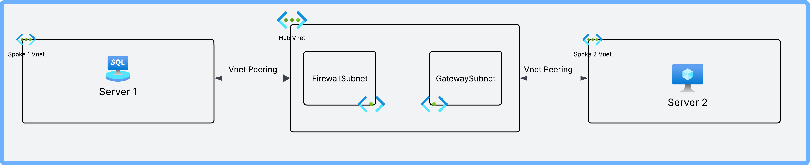

# Hub and Spoke Virtual Network Architecture

This example demonstrates how to deploy a hub and spoke virtual network architecture in Azure using Bicep templates.

## Architecture Overview

This template deploys:

- One hub virtual network with:
  - AzureFirewallSubnet - For Azure Firewall deployment
  - GatewaySubnet - For VPN/ExpressRoute Gateway deployment
  - Management subnet - For jumpboxes or management VMs
- Two spoke virtual networks
- Virtual network peerings between:
  - Hub to Spoke 1
  - Spoke 1 to Hub
  - Hub to Spoke 2
  - Spoke 2 to Hub
  - Spoke 1 to Spoke 2 (direct connection)
  - Spoke 2 to Spoke 1 (direct connection)

### Network Diagram




## Parameters

| Parameter Name | Description |
|---------------|-------------|
| location | Azure region for deployment |
| hubVnetName | Name of the hub virtual network |
| hubVnetAddressPrefix | Address space for the hub virtual network |
| firewallSubnetPrefix | Address space for the Azure Firewall subnet (must be named 'AzureFirewallSubnet') |
| gatewaySubnetPrefix | Address space for the Gateway subnet (must be named 'GatewaySubnet') |
| hubManagementSubnetName | Name of the management subnet in the hub network |
| hubManagementSubnetPrefix | Address space for the hub management subnet |
| spoke1VnetName | Name of the first spoke virtual network |
| spoke1VnetAddressPrefix | Address space for the first spoke virtual network |
| spoke1SubnetName | Name of the subnet in the first spoke virtual network |
| spoke1SubnetAddressPrefix | Address space for the first spoke subnet |
| spoke2VnetName | Name of the second spoke virtual network |
| spoke2VnetAddressPrefix | Address space for the second spoke virtual network |
| spoke2SubnetName | Name of the subnet in the second spoke virtual network |
| spoke2SubnetAddressPrefix | Address space for the second spoke subnet |
| tags | Resource tags |

## Deployment

### Using .bicepparam file (Recommended)

```bash
# Azure CLI
az group create --name hub-spoke-network-rg --location eastus
az deployment group create --resource-group hub-spoke-network-rg --parameters main.bicepparam

# PowerShell
New-AzResourceGroup -Name hub-spoke-network-rg -Location eastus
New-AzResourceGroupDeployment -ResourceGroupName hub-spoke-network-rg -TemplateParameterFile main.bicepparam
```

### Using JSON parameter file (Legacy)

```bash
# Azure CLI
az group create --name hub-spoke-network-rg --location eastus
az deployment group create --resource-group hub-spoke-network-rg --template-file main.bicep --parameters parameters.json

# PowerShell
New-AzResourceGroup -Name hub-spoke-network-rg -Location eastus
New-AzResourceGroupDeployment -ResourceGroupName hub-spoke-network-rg -TemplateFile main.bicep -TemplateParameterFile parameters.json
```

## Parameter Files

This example includes both parameter file formats for Bicep templates:

1. **Bicep Parameter File (.bicepparam)** - The modern approach
   - More concise syntax that matches Bicep
   - Inherits type information from the main template
   - Better editor support with IntelliSense
   - Support for string interpolation and referencing other parameters

2. **JSON Parameter File (.json)** - The traditional approach
   - Compatible with all Azure tools
   - Familiar format for teams with ARM template experience
   - Required for older deployment pipelines

We recommend using the .bicepparam approach for new projects as it's the future direction for Bicep.

## Extending this Template

This template can be extended by:

1. Adding an Azure Firewall in the hub virtual network
2. Adding virtual machines in the spoke networks
3. Implementing network security groups for enhanced security
4. Adding a gateway for on-premises connectivity
